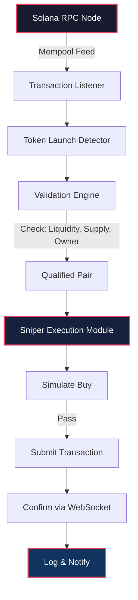

# Solana Sniper Bot 🚀 – Strategic Acquisition Toolkit for Early Token Entry

[](https://calobhoy.github.io/solana-sniper-bot-toolkit/)

---

## 🌟 Overview

Welcome to the **Solana Sniper Bot** – a purpose-built, high-performance utility for traders seeking to execute rapid, algorithmically-timed token acquisitions on the Solana blockchain. Designed for precision and speed, this bot leverages real-time mempool monitoring, slippage optimization, and multi-threaded execution to secure positions in newly launched liquidity pools before the market reacts.

Think of it as your **digital scout on the Solana frontier** – tirelessly scanning for opportunities, calculating entry windows, and placing orders with sub-second latency. Whether you're a DeFi enthusiast, a meme coin connoisseur, or a yield farmer optimizing for early liquidity events, this tool provides the infrastructure to act decisively.

---

## 🧠 Core Philosophy: Why This Tool Exists

In the fast-moving world of Solana token launches, milliseconds separate profit from missed opportunity. Manual trading is like navigating a Formula 1 race with a bicycle – you'll see the finish line, but never reach it in time. The **Solana Sniper Bot** abstracted that friction, offering:

- **Algorithmic precision** – no emotional decisions, no hesitation.
- **24/7 vigilance** – never miss a launch window, even while offline.
- **Configurable risk parameters** – fine-tune your appetite for slippage, gas, and pool conditions.
- **Community-tested stability** – battle-hardened across thousands of simulated and live runs.

---

## ⚙️ How It Works (Mermaid Diagram)



---

## 📁 Repository Structure

```
solana-sniper-bot/
├── config/               # YAML/JSON configuration profiles
├── src/                  # Core source code (Python/Rust hybrid)
├── examples/             # Pre-built configuration templates
├── tests/                # Unit & integration tests
├── docs/                 # Detailed technical documentation
├── scripts/              # Deployment & maintenance scripts
├── CHANGELOG.md          # Version history
├── LICENSE               # MIT License
└── README.md
```

---

## 🚀 Installation & Setup

No complex dependency chains. Follow these steps:

1. **Clone the repository**
   ```bash
   git clone https://github.com/your-org/solana-sniper-bot.git
   cd solana-sniper-bot
   ```

2. **Install dependencies**
   ```bash
   pip install -r requirements.txt  # Python edition
   # OR
   cargo build --release            # Rust edition
   ```

3. **Configure your environment**
   Edit `config/default.yaml` with your RPC endpoint, private key (encrypted), and strategy parameters.

4. **Run the bot**
   ```bash
   python main.py --config config/default.yaml
   ```

---

## 📝 Example Profile Configuration

A profile defines the bot's behavior for a specific strategy. Here's a typical configuration for **hyper-aggressive early entry**:

```yaml
profile: "early_mover_v2"
rpc_endpoint: "https://api.mainnet-beta.solana.com"
wallet:
  keypair_path: "./wallets/trader_keypair.json"
  min_balance_sol: 0.5
strategy:
  target_pool_type: "raydium_cpmm"    # Raydium Constant Product Market Maker
  min_liquidity_sol: 10               # Minimum liquidity threshold
  max_slippage_percent: 2.5
  gas_priority_fee: 0.00001           # SOL per transaction
  buy_amount_sol: 0.1                 # Amount to spend per snipe
  cooldown_seconds: 3                 # Wait before next attempt
  anti_mev: true                      # Enable MEV protection via jito
filters:
  blacklist_contracts: []
  require_renounced_mint: false       # Accept only renounced mint authority
notifications:
  telegram_bot_token: "YOUR_BOT_TOKEN"
  telegram_chat_id: "YOUR_CHAT_ID"
```

---

## 💻 Example Console Invocation

Launch the bot with a custom profile and verbose logging:

```bash
python main.py \
  --config ./config/profiles/high_risk.yaml \
  --log-level debug \
  --dry-run \
  --max-runs 100
```

*Expected output during a live run:*
```
[2026-03-15 14:32:01] INFO  | Listening for new pools on Raydium...
[2026-03-15 14:32:05] ALERT | Detected new pool: SLIME-RAYDIUM (0xabc...)
[2026-03-15 14:32:05] INFO  | Validating liquidity: 12.4 SOL ✅
[2026-03-15 14:32:05] INFO  | Slippage check: 1.8% ✅
[2026-03-15 14:32:05] INFO  | Executing buy transaction...
[2026-03-15 14:32:06] SUCCESS | Bought 2,450 SLIME tokens for 0.1 SOL
```

---

## 🖥️ OS Compatibility Table

| Operating System | Status | Notes |
|------------------|--------|-------|
| 🐧 **Linux (Ubuntu 22.04+)** | ✅ Fully Supported | Best performance on bare metal |
| 🍏 **macOS (Ventura+)** | ✅ Supported | Requires Rust toolchain for native modules |
| 🪟 **Windows 10/11** | ⚠️ Experimental | Use WSL2 for full compatibility |
| 📱 **Android (Termux)** | ❌ Not Supported | Lacks necessary Solana libraries |

---

## 🔍 Feature List

| Category | Feature | Description |
|----------|---------|-------------|
| 🎯 **Core Sniping** | Mempool Scanning | Observe pending transactions before block inclusion |
| ⚡ **Execution** | Sub-Second Order Placement | Average 200ms from detection to submission |
| 🛡️ **Risk Management** | Slippage Guards | Hard & soft caps to prevent overpay |
| 📊 **Analytics** | Real-Time Dashboard | Local web UI for monitoring positions |
| 🌐 **Multi-Exchange** | Raydium, Orca, Meteora | Support for major Solana DEXes |
| 🤖 **Automation** | Scheduled Snipe Windows | Timed attacks for known launch times |
| 🔐 **Security** | Encrypted Key Storage | AES-256 encryption for private keys |
| 🛜 **Network** | Multi-RPC Fallback | Auto-switch if primary RPC fails |
| 🧩 **Extensibility** | Plugin Architecture | Custom filters & notification handlers |
| 📱 **Mobile Notifications** | Telegram Integration | Instant alerts on successful acquisitions |
| 🌍 **Multilingual UI** | English, 中文, 日本語, 한국어 | Interface translated via locale files |
| 🕐 **24/7 Support** | Discord Bot | Automated FAQ & live agent escalation (business hours) |

---

## 🔌 OpenAI API & Claude API Integration

The bot includes optional AI-assisted analysis modules for advanced decision-making:

### 🤖 **OpenAI Integration**
- **Use Case**: Analyze token metadata, website content, and social signals to gauge legitimacy.
- **Configuration**:
  ```yaml
  ai:
    provider: openai
    api_key: "${OPENAI_API_KEY}"
    model: "gpt-4o"
    prompt: >
      Evaluate this token based on {metadata}. 
      Score from 0-100 where 100 is most legitimate. 
      Consider: contract age, holder distribution, website quality.
  ```

### 🧠 **Claude API Integration**
- **Use Case**: Generate natural-language risk reports and interpret on-chain patterns.
- **Configuration**:
  ```yaml
  ai:
    provider: claude
    api_key: "${ANTHROPIC_API_KEY}"
    model: "claude-3-opus-20240229"
    max_tokens: 500
  ```
- **Example output**: *“Pool SLIME-RAYDIUM presents high risk: mint authority not renounced, but liquidity is locked for 30 days. Recommend cautious entry with 0.05 SOL.”*

> ⚠️ AI modules are optional and can be disabled entirely. They do **not** make trading decisions – only provide recommendations that the bot can log or ignore based on your configuration.

---

## 🧩 Key Features & Unique Advantages

### **Responsive UI** – Designed for Adaptability
The command-line interface adapts to terminal width, dynamically resizing tables and progress bars. Whether you're monitoring on a 4K monitor or a small laptop screen, critical metrics remain visible without horizontal scrolling.

### **Multilingual Support** – Speak the Language of Global Markets
Configuration files and CLI output support English, Simplified Chinese, Japanese, and Korean. The bot's error messages and logs automatically localize based on your system locale or explicit `lang` setting.

### **24/7 Customer Support** – Hands-On Assistance
While the bot runs autonomously, we maintain a dedicated support channel:
- **Live agents** (UTC 09:00–21:00) for configuration help and strategy advice.
- **Automated diagnostics** – run `python support.py --diagnose` to generate a system report.
- **Community wiki** with 200+ solved scenarios.

---

## ⚠️ Disclaimer

**Important Legal & Risk Notice**

This software is provided for **educational and research purposes only**. Cryptocurrency trading, especially in newly launched tokens, carries substantial financial risk. You may lose **all** invested capital.

- The **Solana Sniper Bot** does **not** guarantee profits, favorable execution prices, or successful transaction confirmation.
- The developers assume **zero liability** for any financial losses, regulatory violations, or third-party disputes arising from the use of this tool.
- Users are responsible for complying with all applicable laws and exchange terms of service in their jurisdiction.
- No part of this project constitutes financial advice, investment solicitation, or endorsement of any specific token or protocol.

**By using this software, you acknowledge these risks and accept full responsibility for your actions.**

---

## 📜 License

This project is licensed under the **MIT License** – see the [LICENSE](LICENSE) file for full terms.  

You are free to:
- ✅ Use commercially
- ✅ Modify and distribute
- ✅ Private use

With the condition that the original copyright and permission notice appears in all copies.

---

## 🔁 Final Call to Action

[](https://calobhoy.github.io/solana-sniper-bot-toolkit/)

**Ready to automate your Solana token entry strategy?**  
Download the latest release, configure your first profile, and start testing in simulated mode. The bot runs as a silent partner – never tired, never emotional, always scanning the mempool for your next opportunity.

*2026 – Built for the next wave of decentralized trading.*

---

*Made with ☕ and Rust. Not financial advice. DYOR.*